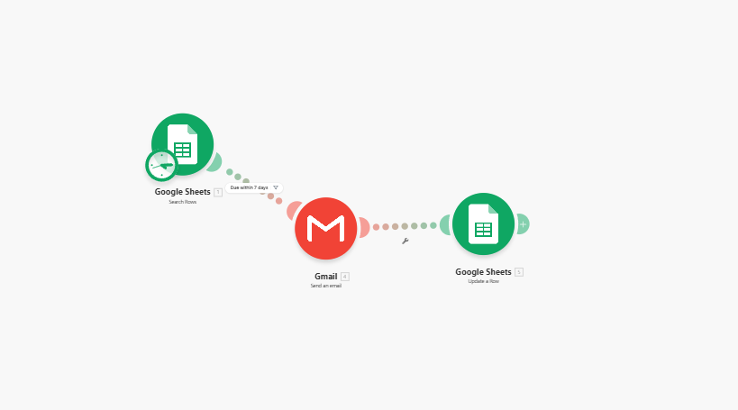

 

 

---

## 🙋 About Me

I build interactive, user-friendly web and mobile applications — always exploring new technologies and eager to integrate AI into products that solve real problems.

---

---
## 🚀 Projects
### 🏆 Interactive Classroom Management System *(Capstone · 2024)*
> 🥇 Best in System &nbsp;·&nbsp; Best in Research Paper &nbsp;·&nbsp; Best Presenter &nbsp;·&nbsp; Best Project for Community Extension &nbsp;·&nbsp; **Overall Best Project**
 
Developed an interactive classroom management system that enhances engagement and efficiency through 2D animations, mobile accessibility, and a kiosk-based interface. Streamlined attendance tracking, announcements, grading, and game-based performance activities.
### ⚡ Subscription Reminder Automation *(Automation & AI Integration)*
Automates subscription tracking by monitoring due dates, sending timely email reminders, and updating statuses — eliminating manual work and reducing missed payments. Built to scale and expandable with AI for personalized reminders, smarter notification timing, and automated billing triggers.

### 🏥 Clinic Management System
Designed and implemented a system to manage patient records, admissions, and inventory, improving clinic efficiency and data accuracy.
 
 
---

## 💼 Experience

### 📱 Flutter Mobile Developer Intern — [BMware Business Solutions Enterprises Inc.](https://www.facebook.com/BMwareBusinessSolutionsEnterprisesInc)
**Dec 2025 – Present &nbsp;|&nbsp; Philippines (I.T. Consultancy & Software Company)**

- 🚀 Developed and published a **mobile app now live on Google Play Store** — handling the full deployment pipeline through Google Play Console
- 🎮 Developed a **mobile game** using Flutter, contributing to game logic, UI, and user experience
- 📱 Built and maintained cross-platform mobile applications with real client-facing features using **Flutter & Dart**
- 🤝 Worked with the team on **mobile UI/UX, state management, and REST API integration** across production-grade projects

---

## 🛠️ Tech Stack

  
   
  

---

